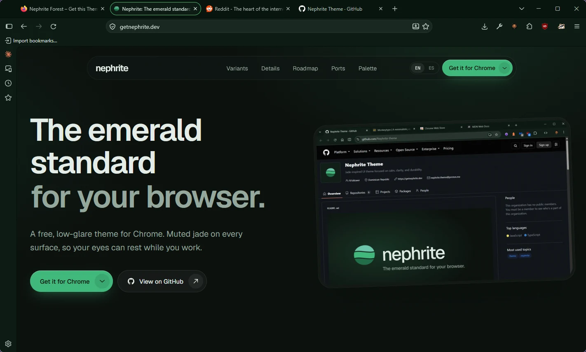
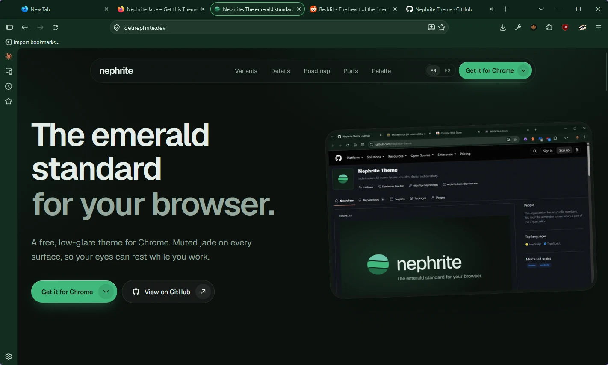
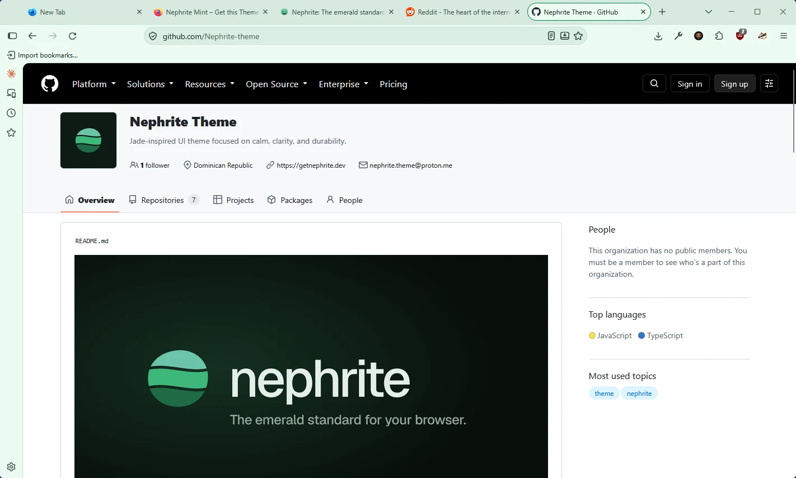
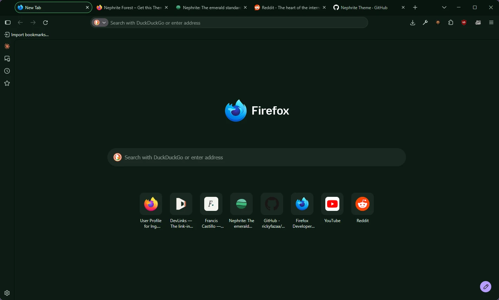
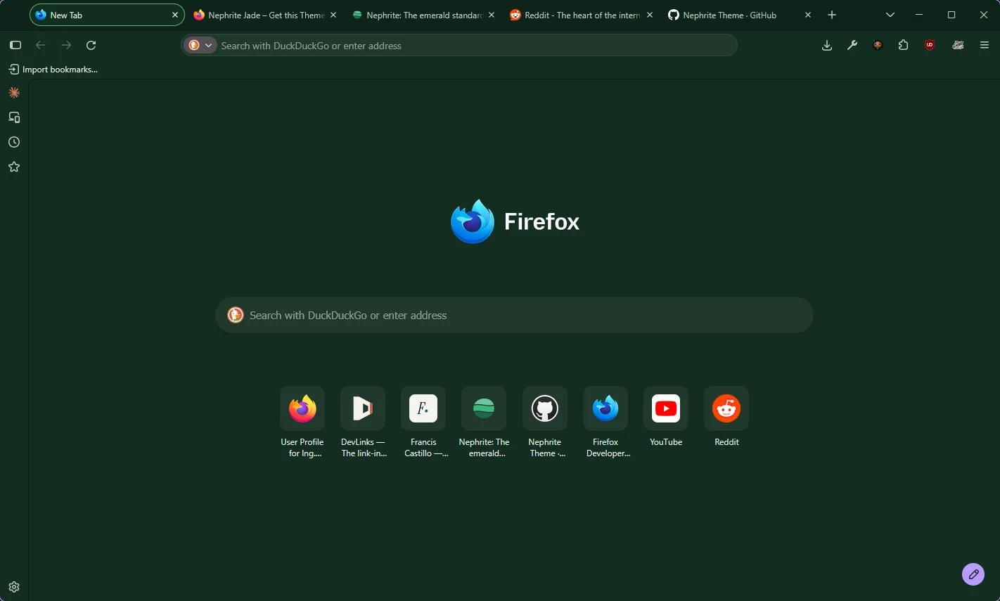
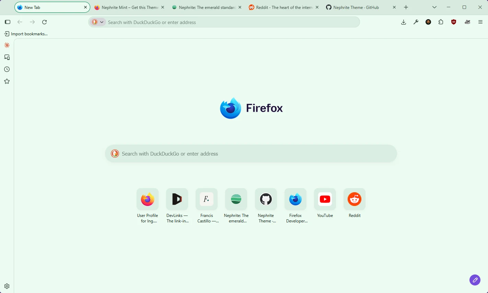

<div align="center">


# Nephrite for Firefox

**English** · [Español](README.es.md)

A calm, jade-inspired theme for [Firefox](https://www.mozilla.org/firefox/), in three flavors.

[](LICENSE)
[](https://github.com/Nephrite-theme/palette)

</div>

## Flavors

| Flavor | Colors | For | Install |
| --- | --- | --- | --- |
| **Forest** |  | Deep and dark, for late nights | [Firefox Add-ons](https://addons.mozilla.org/firefox/addon/nephrite-forest/) |
| **Jade** |  | Dark with more green, for long days | [Firefox Add-ons](https://addons.mozilla.org/firefox/addon/nephrite-jade/) |
| **Mint** |  | Light and airy, for daylight | [Firefox Add-ons](https://addons.mozilla.org/firefox/addon/nephrite-mint/) |

## Previews

| Forest | Jade | Mint |
| --- | --- | --- |
|  |  |  |
|  |  |  |

## Install

### From Firefox Add-ons (recommended)

Open the link for the flavor you want and click **Add to Firefox**. Installing another flavor replaces the current one.

### Manually

1. Click **Code > Download ZIP** and unzip it. Each flavor lives in its own folder under `themes/`, for example `themes/Nephrite Forest`.
2. Open `about:debugging#/runtime/this-firefox`.
3. Click **Load Temporary Add-on** and select the flavor's `manifest.json`.

Temporary add-ons are removed when Firefox restarts. To go back to the default look, open `about:addons` > **Themes** and enable **System theme**.

## Colors

Every color comes from the [Nephrite palette](https://github.com/Nephrite-theme/palette), mapped to Firefox by role:

| Firefox surface | Palette color |
| --- | --- |
| Tab strip (frame) | `mantle`, `crust` when the window is inactive |
| Selected tab, toolbar, new tab page | `base` |
| Address bar and search fields | `surface0`, with a `jade` border on focus |
| Menus, dropdowns and sidebar | `mantle`, `surface1` for the highlighted row |
| Main text | `text` |
| Inactive tabs and toolbar icons | `subtext` |
| Selected tab line, loading indicator, attention icons | `jade` |

Menus, `about:` pages and web content also follow the flavor's light or dark scheme.

## Development

The manifests in `themes/` are generated, so don't edit them by hand. To pick up palette changes:

```sh
node scripts/sync-palette.mjs   # download the latest palette.json
node scripts/build.mjs          # regenerate the three manifests
```

To publish, bump `VERSION` in `scripts/build.mjs`, rebuild, and zip the **contents** of each flavor folder so `manifest.json` sits at the root of the ZIP:

```powershell
Compress-Archive -Path "themes/Nephrite Forest/*" -DestinationPath nephrite-forest.zip
```

Then upload it at [addons.mozilla.org/developers](https://addons.mozilla.org/developers/). Each flavor has a fixed add-on ID (`nephrite-<flavor>@getnephrite.dev`), so updates stay on the same listing. Node 18 or newer, no dependencies.

## Contributing

Found a color that clashes or low contrast? [Open an issue](https://github.com/Nephrite-theme/firefox/issues/new/choose) with a screenshot. For how Nephrite ports are built and reviewed, see the [contributing guide](https://github.com/Nephrite-theme/.github/blob/main/CONTRIBUTING.md).

## Thanks

Created and maintained by [@ingfranciscastillo](https://github.com/ingfranciscastillo). Contributors will be listed here as the community grows.

## More Nephrite

Nephrite is also available for Chrome, and coming to VS Code and more. See every app at [getnephrite.dev/ports](https://getnephrite.dev/ports).
